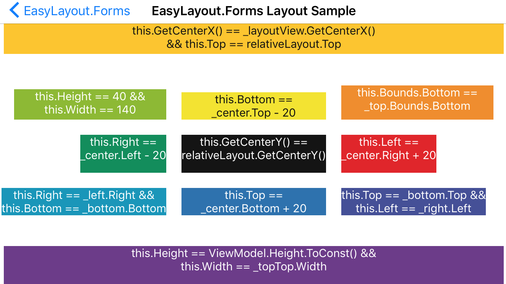

# EasyLayout.Forms
EasyLayout.Forms makes it easier to read, write, and maintain relative layouts in Xamarin Forms. It's a port of [EasyLayout.Droid](https://github.com/lprichar/EasyLayout.Droid) which is a port of Frank Krueger's EasyLayout (https://gist.github.com/praeclarum/6225853) for iOS.

## What Is It

For getting started read [Introducing EasyLayout for Xamarin.Forms: For Concise, Maintainable & Fast Programmatic UI's](http://www.leerichardson.com/2017/05/introducing-easylayout-for-xamarinforms.html).

After that take a look at the [sample project](https://github.com/lprichar/EasyLayout.Forms/blob/master/EasyLayout.Sample/EasyLayout.Sample/Views/LayoutExamplePage.cs).



## Example 1 - Parent Align

If you want to align a label centered horizontally and at the top of the screen with a 10px margin you used to do this:

````
Size GetSize(VisualElement ve, RelativeLayout rl) => ve.Measure(rl.Width, rl.Height).Request;

relativeLayout.Children.Add(label,
    Constraint.RelativeToParent(rl => (rl.Width * .5) - (GetSize(label, rl).Width * .5))
    Constraint.RelativeToParent(rl => rl.Y + 10,
    );
````
Note the GetSize() helper.  That's because:

1. Xamarin.Forms layouts only allow constraining the top left pixel of any given view (label in this case)
2. Constaining the right, center, or bottom requires knowing the height/width of the control and doing some math
3. Xamarin.Forms doesn't know the width or height of most views until after they're rendered (see [here](http://stackoverflow.com/questions/40942691/xamarin-forms-how-to-center-views-using-relative-layout-width-and-height-r))

Instead, now you can do this:

````
relativeLayout.ConstrainLayout(() =>
    label.Top() == relativeLayout.Top() + 10
    && _image.CenterX() == relativeLayout.CenterX()
    );
````

You no longer need to do any math or worry about how to get the size of a non-rendered view.

Incidentally, Top(), Bottom(), Right(), Left(), CenterX(), and CenterY(), are new extension methods, along with ToConst() for variables.

## Example 2 - Relative Alignment and Constants

If you wanted to parent align right label1 then place label2 under it aligned to label1's right edge you used to do this:

````
Size GetSize(VisualElement ve, RelativeLayout rl) => ve.Measure(rl.Width, rl.Height).Request;

relativeLayout.Children.Add(label1,
    Constraint.RelativeToParent(parent => parent.X + 10),
    Constraint.RelativeToParent(parent => parent.Y - GetSize(label1).Width - 10)
    );

relativeLayout.Children.Add(label2,
    Constraint.RelativeToView(label1, (rl, l1) => l1.X + l1.Width - GetSize(label1)),
    Constraint.RelativeToView(label1, (rl, l1) => l1.Y + l1.Height + 10));
````

While the math isn't rocket science, it's hard to read and it'd be easy to hide a bug in there.

EasyLayout.Forms replaces the code above with:

````
relativeLayout.ConstrainLayout(() =>
    label1.Top() == relativeLayout.Top() + 10 &&
	label1.Right() == relativeLayout.Right() - 10

    label2.Top() == label1.Bottom() + 10 &&
    label2.Right() == label1.Right()
    );
````

That's less code and easier to read plus there's some other small benefits.  

## Release Notes

### 1.1

Replaces the syntax label1.Bounds.Left with an extension method based syntax label1.Left().  This fixes compiler warnings
about "Equality comparison of floating point numbers" and makes the syntax more concise.  The old syntax is still supported
but should be considered deprecated.  The .Bounds syntax will be removed in subsequent versions.  

You can also now use the Height and Width properties directly off of views or the new Height and Width extension methods, e.g. label1.Height == label2.Height().

## Installation

If you want to add this to your project you can either [install via NuGet](https://www.nuget.org/packages/EasyLayout.Forms/) (safer):

`Install-Package EasyLayout.Forms`

or if you think it's perfect as is (you don't want updates) you can copy [EasyLayout.cs](https://github.com/lprichar/EasyLayout.Forms/blob/master/EasyLayout.Forms/EasyLayout.cs) into your source.

## License

All code is MIT Licensed.
